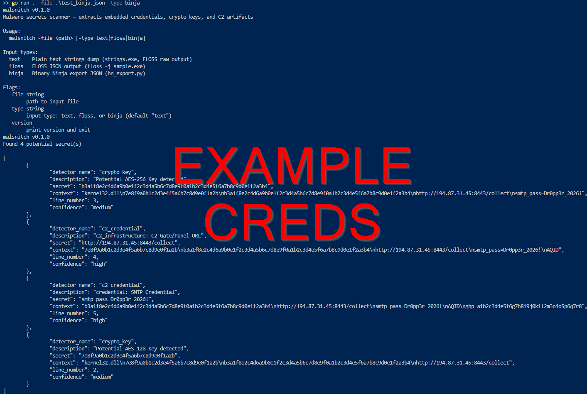

# malsnitch

- Reversing some malware? 
- Tired of eyeballing string dumps for hardcoded creds?
- Short on time?

Look no further! 

malsnitch is a CLI tool meant to assist RE workflows by scanning artifacts like string dumps, FLOSS output, or Binja exports. It extracts embedded secrets malware authors put in their binaries. 
- C2 creds
- crypto keys
- API tokens
- exfil channel configs
- more!

TO BE CLEAR - this is not another developer secrets scanner. Tools like TruffleHog or Gitleaks catch API keys being committed to legitimate repos. malsnitch gets the RC4 key buried in `.rdata` or the SMTP password to a random C2 server.

(Also, I'm proud of myself for not shoehorning in "Go" anywhere in the title.)

## Features

- Detects embedded crypto keys (AES-128, AES-256, RC4)
- Detects C2 infrastructure
- Detects exfil channel creds (Discord webhooks, Telegram bot tokens)
- Detects hardcoded credentials (SMTP, FTP, HTTP, etc)
- Detects API keys (GitHub PATs, AWS, Stripe, Slack, SendGrid, Mailgun)
- Memory dump scanner
- Auto deduplication and substring suppression
- Structured JSON output to stdout
- Supports multiple input formats:
    - `text`: raw strings dump (e.g. strings.exe or FLOSS raw output)
    - `floss`: FLOSS JSON output
    - `binja`: Binary Ninja export JSON (via the included `bn_export.py`)

## Usage

1. Clone the repo OR install the Go package:

```
git clone https://github.com/grepstrength/malsnitch.git
cd malsnitch
```

OR

```
go install github.com/grepstrength/malsnitch@latest
```

2. Build:

```
go build -o malsnitch.exe .
```

3. Run against a strings dump:

```
.\malsnitch.exe -file strings_output.txt -type text
```

4. Run against FLOSS JSON output:

```
.\malsnitch.exe -file floss_report.json -type floss
```

5. Run against a Binary Ninja export:

```
.\malsnitch.exe -file bn_export.json -type binja
```

6. Run against a memory dump:

```
.\malsnitch.exe -file memdump.bin -type memdump
```

7. Pipe JSON output to a file:

```
.\malsnitch.exe -file sample_strings.txt > <FILENAME>.json
```

8. Save the results to a CSV:

```
.\malsnitch.exe -file sample_strings.txt -type text -output csv > <FILENAME>.csv
```

## Examples

### Try It Yourself

```
.\malsnitch.exe -file examples\test_strings.txt -type text
.\malsnitch.exe -file examples\test_binja.json -type binja
.\malsnitch.exe -file examples\test_floss.json -type floss
.\malsnitch.exe -file examples\test_memdump.bin -type memdump
```

### Output



## Binary Ninja Plugin

A python export script is included in `scripts/bn_export.py`. You can run this inside Binja's script console or headless:
```bash
python bn_export.py sample.exe output.json
```
This produces the JSON format that malsnitch consumes with `-type binja`.

## Exit Codes

| Code | Meaning |
|------|---------|
| 0    | Secrets found |
| 1    | Error (bad input, missing file, etc.) |
| 2    | Clean scan, no secrets detected |

## Future Roadmap

1. PCAP input
2. MITRE ATT&CK mapping

## License

MIT license. No restrictions. 